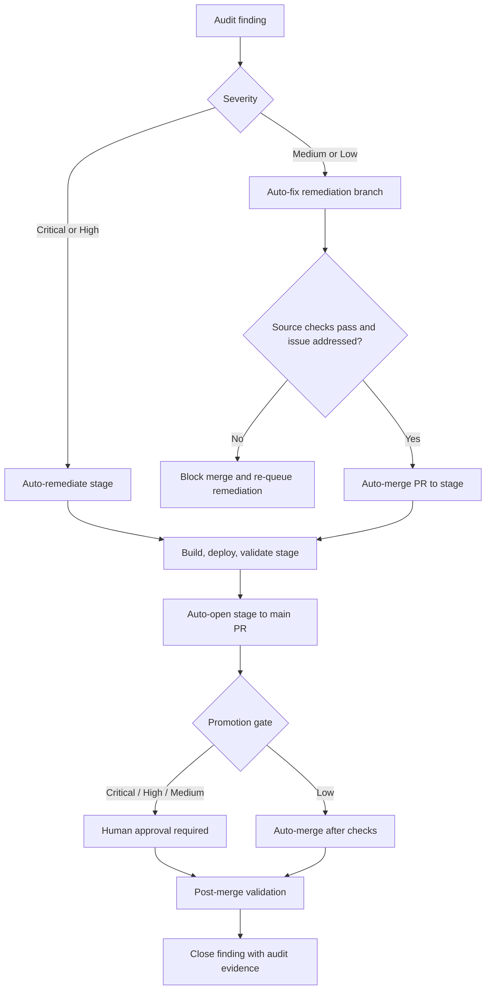
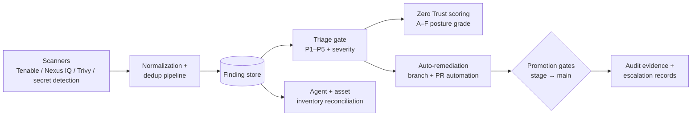

# siem-soar — Cloud Security Automation Hub (Public Showcase)

> **This is the public showcase for a private, production codebase.** It exists
> to demonstrate and verify the functionality of the Starks Enterprise SIEM/SOAR
> platform for freelance and consulting engagements. Implementation source,
> pipeline definitions, scanner credentials, and operational runbooks remain
> private.

`siem-soar` is the centralized security discovery, auditing, automated
remediation, and verification hub built and operated by
[Starks Enterprise](https://starksenterprise.com). It acts as the catch-all
SOAR/SIEM control plane across every repository and cloud workload in the
organization.

---

## What the platform does

- **Exposed-credential detection** — continuous scanning for leaked cloud
  credentials (AWS access keys, tokens, secrets) across all managed
  repositories, with automated revocation workflows.
- **IaC and IAM drift auditing** — detection of infrastructure-as-code
  misconfigurations, IAM policy drift, and dependency vulnerabilities.
- **Agentic threat detection and remediation** — a dedicated pipeline for
  risks introduced by LLM-based agents, MCP servers, and autonomous tool-use
  workflows, including a declared-agent inventory reconciled against
  discovered agents.
- **CVE lifecycle management** — a scanner-agnostic ingestion pipeline
  (Tenable, Nexus IQ, Trivy, and compatible scanners) with a normalization
  schema, dedup key spec, P1–P5 triage gate, environmental scope routing
  (cloud / container / intra-repo / on-premise / vendor), cross-repo
  broadcast, and targeted rescan verification before closure.
- **Zero Trust posture assessment** — every finding is scored against the
  Microsoft Zero Trust principles (*verify explicitly*, *use least
  privilege*, *assume breach*), producing a tenant-wide A–F grade and
  worst-offender reporting.
- **Vault configuration governance** — enforces `vault-config-operator` as
  the sole reviewed writer of Vault configuration for USEA and Vault-agent
  workflows, and verifies the operator-bridge handoff with reviewed GitOps
  fallback and explicit rejection handling.
- **Automated remediation with severity gates** — findings are auto-fixed on
  remediation branches, validated, and auto-merged to `stage`; promotion of
  Critical/High/Medium changes to `main` requires human approval, while
  validated Low-severity changes auto-merge.
- **Centralized audit evidence** — every security change carries traceable
  audit evidence, escalation records, and DR planning hooks aligned to
  ServiceNow/ITIL practices with SLA-based escalation.

## Security loop

```text
Audit -> Auto-fix -> Validate -> Auto-merge feature to stage -> Build/deploy stage
      -> Validate stage -> Auto-open stage to main PR -> Severity promotion gate
      -> Post-merge validation -> Close

Critical/High: immediate stage remediation -> human promotion
Medium:        feature -> stage (automatic) -> main (human promotion)
Low:           feature -> stage (automatic) -> main (automatic after checks)

CVE pipeline (separate, parallel):
  Scanner ingest (Tenable / Nexus IQ / Trivy / …) -> Triage gate (P1–P5)
  -> P1: emergency stage remediation  |  P2–P5: remediation/<cve-id> branch
  -> Environmental scope gate -> Cross-repo broadcast
  -> Targeted rescan confirmation -> CLOSED
```



## Architecture at a glance



## Engineering & security posture

- **No secrets in source** — scanner and cloud credentials live in a cloud
  secret manager and reach pipelines only through secret references; all
  repositories are gated by secret-detection pre-commit hooks and CI scanning.
- **Human-in-the-loop by severity** — automation handles the repeatable work;
  humans approve every Critical, High, and Medium promotion to production.
- **Tested pipeline** — the normalization, triage, finding-store, Zero Trust
  scoring, and agent-discovery components are covered by an automated pytest
  suite.
- **Least-privilege operations** — remediation automation runs with
  fine-grained, environment-scoped tokens that are never exposed to clients.

## Freelance / consulting verification

This repository verifies real, deployed security automation work by Starks
Enterprise. Related service offerings include AI security evaluations, PAM/IAM,
cloud security architecture, compliance and risk, penetration testing, incident
response, and vCISO advisory.

- Website: https://starksenterprise.com
- Engagements: sales@starksenterprise.com

## Responsible disclosure

If you believe you've found a security issue in any Starks Enterprise system,
please report it privately to sales@starksenterprise.com rather than opening a
public issue.

## License

Copyright © 2026 Starks Enterprise LLC. Documentation is provided for
evaluation and verification purposes; all rights reserved.
